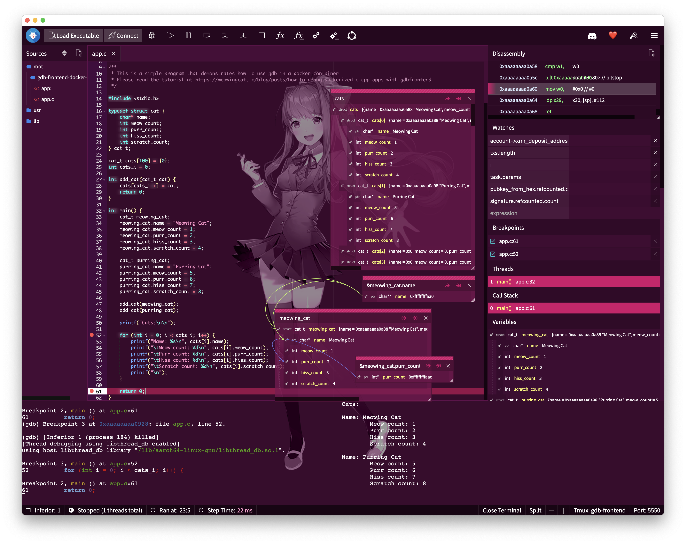

# gdb-frontend-docker-example

App to tutor using GDBFrontend to debug Dockerized C/C++ apps.

## Read the Tutorial

Read the tutorial on Meowing Cat's blog, [How to debug Dockerized C/C++ apps with GDBFrontend](https://meowingcat.io/blog/posts/how-to-debug-dockerized-c-cpp-apps-with-gdbfrontend).

## License

MIT License
